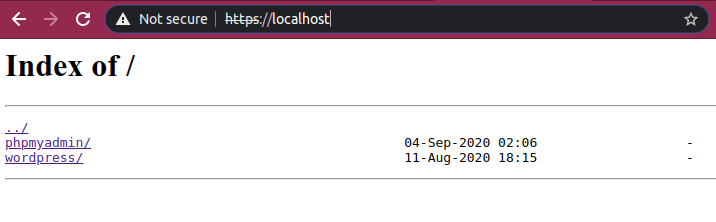
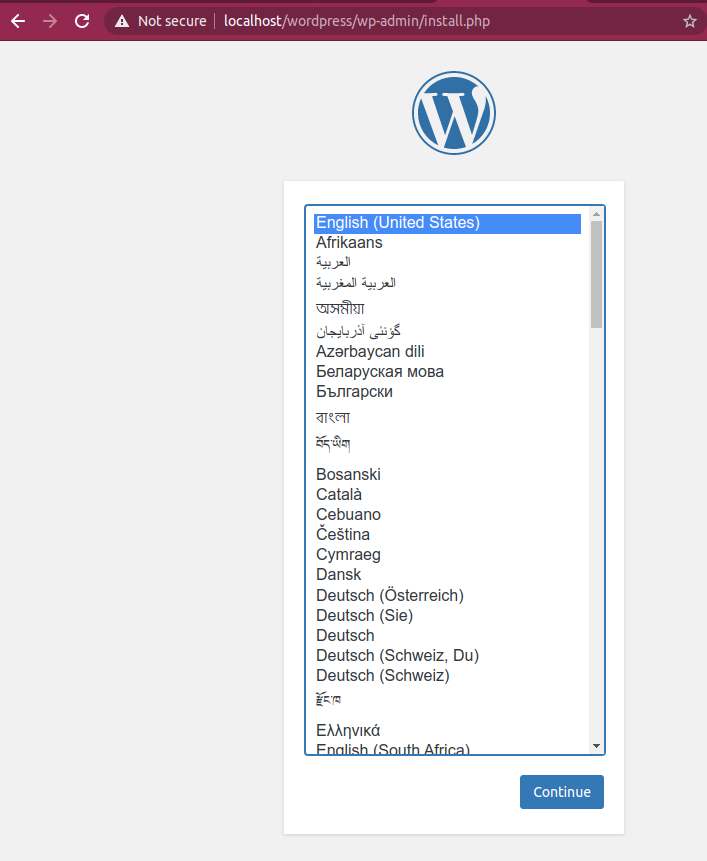
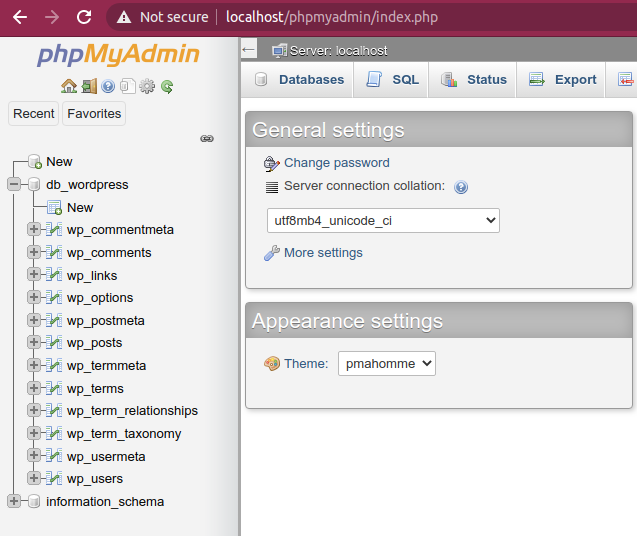

# ft_server  :whale2: :whale2:
This project consists of set up a web server with **Nginx, phpMyAdmin, MySQL, WordPress and SSL on Docker**

##  General :bell:
**Docker** is a standard to build and share containerized apps.


## How to use?
Run the script 
```bash
./src/build_run.sh
```
## Explanation
```bash
# Build the image based on our Dockerfile
docker build -t ft_server .

# Clean other our old containers
docker rm -f $(docker ps -qa)

# Create the container who execute a script on CMMD => setup_application.sh
docker run --name ft_server -it  -p 80:80 -p 443:443 ft_server
```
**Ports**
- Port **80** is where nginx is listening
- Port **443** is used for secure web browser communication

### Nginx Autoindex in "on"	:busstop:
NGINX is open source software for web serving, reverse proxying, caching, load balancing, media streaming, and more. (For ft_server we are using it as a web serving)


### PhpMyAdmin	:busstop:
phpMyAdmin is a free software tool written in PHP, intended to handle the administration of MySQL over the Web.


### Wordpress	:busstop:
WordPress is the simplest, most popular way to create your own website or blog.


### MySql database	:busstop:
MySQL is a relational database management system based on SQL – Structured Query Language



## Docker Commands

### Images
```bash
docker build -t ft_server .
```
### Container

```bash
# Run container
docker run --name ft_server -it  -p 80:80 -p 443:443 ft_server 
 # Show running containers
docker ps
# Show dead containers
docker ps -a 
# Open the running container
docker exec -it ft_nginx /bin/bash
# Stop the running container
docker stop ft_nginx
```

### Resources :jack_o_lantern:

- [Create ssl keys](https://linuxize.com/post/creating-a-self-signed-ssl-certificate/)
- [Confgure nginx for ssl](https://phoenixnap.com/kb/install-ssl-certificate-nginx)
- [Owner of wordpress](https://emiliocastro.com.mx/fixing-wordpress-a-mini-tutorial/)
- [Configure wordpress](https://wordpress.org/support/article/editing-wp-config-php/)


### ft_server pdf  new curriculum
[Download from HERE](https://drive.google.com/file/d/1OlPM7qewRFtc-hkJ7k1q1FJ4vTv1xkWT/view?usp=sharing)

