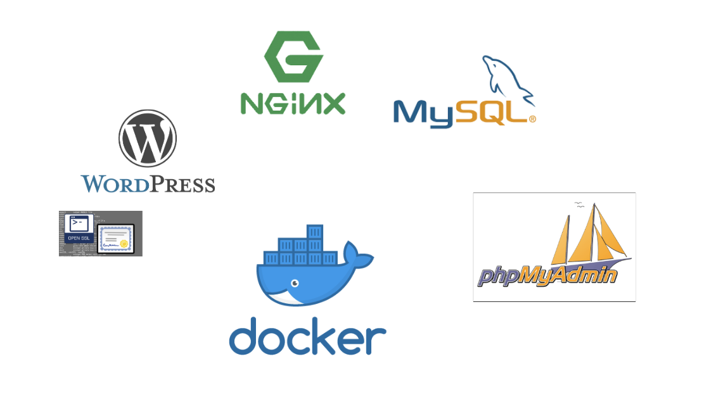
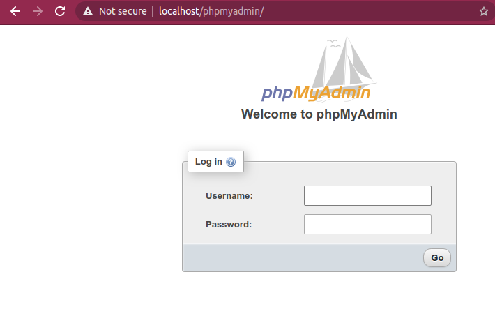

# ft_server  :whale2: :whale2:
Set up a web server with Nginx, phpMyAdmin, MySQL, WordPress and SSL on Docker.

# How to use?
Run the script to build and run the container, the container will keep running because it calls bash, then after running the script you will be inside the container:
```bash
./src/build_run.sh
```

# Explanation
**Ports**
Port **80** is where nginx is listening
Port **443** is used for secure web browser communication
```bash
# Build the image based on our Dockerfile
docker build -t ft_server .

# Clean other our old containers
docker rm -f $(docker ps -qa)

# Create the container who execute a script on CMMD => setup_application.sh
docker run --name ft_server -it  -p 80:80 -p 443:443 ft_server
```

##  General Process :bell:



## Nginx Autoindex in "on"


## PhpMyAdmin


## Wordpress


## MySql database


## Docker Commands

### Images
```bash
docker build -t ft_server .
```
### Container
Run container
```bash
docker run --name ft_server -it  -p 80:80 -p 443:443 ft_server
```
See running containers
```bash
docker ps
```
See dead containers
```bash
docker ps -a
```
Open the running container
```bash
docker exec -it ft_nginx /bin/bash
```
Stop the running container
```bash
docker stop ft_nginx
```

### Resources :jack_o_lantern:

[Create ssl keys](https://linuxize.com/post/creating-a-self-signed-ssl-certificate/)

[Confgure nginx for ssl](https://phoenixnap.com/kb/install-ssl-certificate-nginx)

[ Owner of wordpress](https://emiliocastro.com.mx/fixing-wordpress-a-mini-tutorial/)

[Configure wordpress](https://wordpress.org/support/article/editing-wp-config-php/)


### ft_server pdf  new curriculum
[Download from HERE](https://drive.google.com/file/d/1OlPM7qewRFtc-hkJ7k1q1FJ4vTv1xkWT/view?usp=sharing)
 
